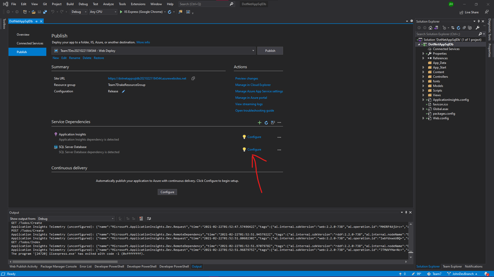
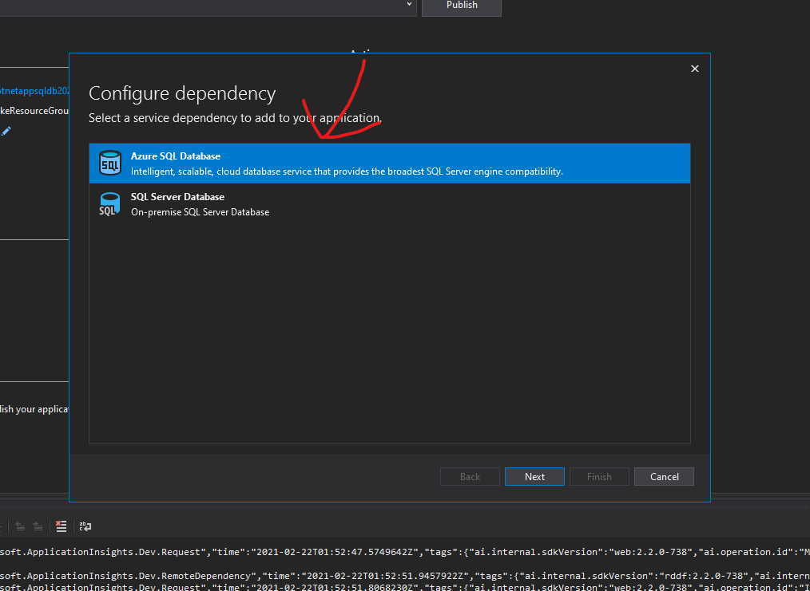
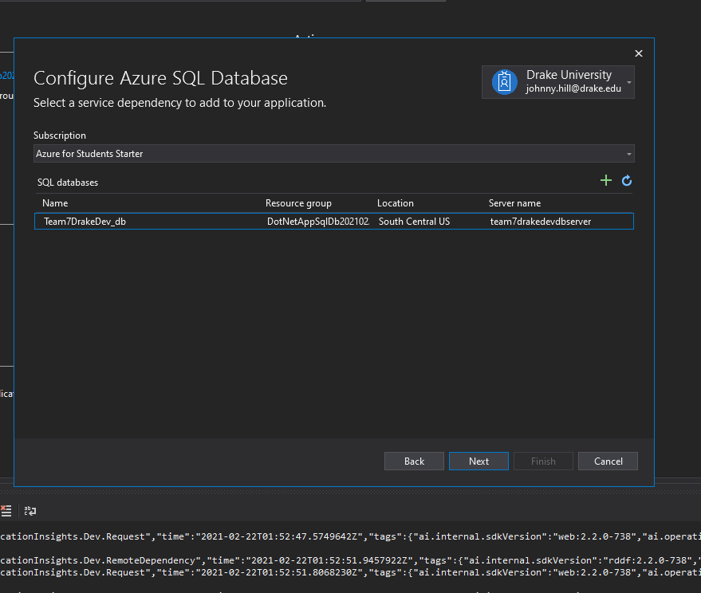
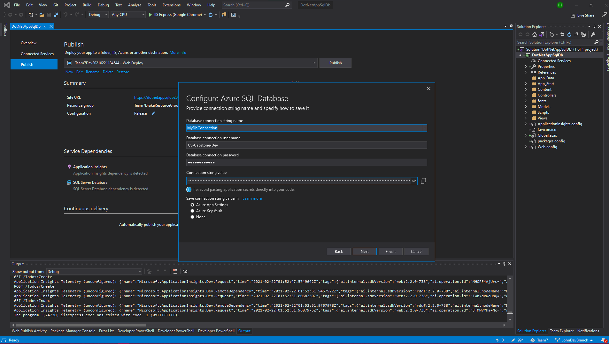
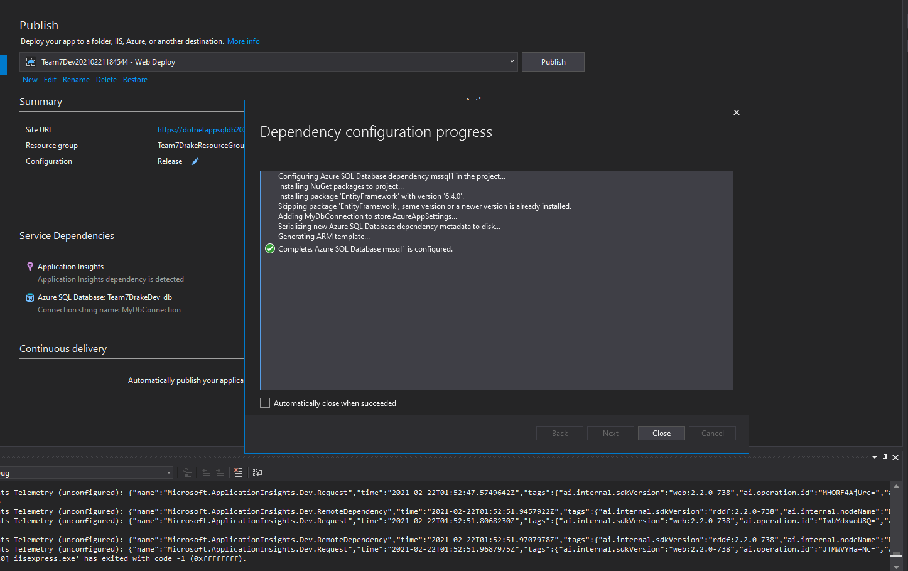

# Notes: 
view our [Dev Live site](https://dotnetappsqldb20210221184544.azurewebsites.net/)

## Prerequites
* Visual Studio 2019
* Git 
* Azure Data Studio 
* IP given to admin and added to firwall


## Links 
[React ASP.Net MVC Enviroment Setup](https://www.c-sharpcorner.com/article/my-first-react-application-with-asp-net-mvc/) 
[React ASP.Net Full Stack Tutorial](https://www.youtube.com/watch?v=NemyDIUcC64&ab_channel=CodAffection)
[React ASP.Net MVC Enviroment Setup](https://www.c-sharpcorner.com/article/my-first-react-application-with-asp-net-mvc/) 
[Express Backend Enviroment Setup](https://www.freecodecamp.org/news/create-a-react-frontend-a-node-express-backend-and-connect-them-together-c5798926047c/)
[Azure Deployment](https://jasonwatmore.com/post/2020/01/10/react-aspnet-core-on-azure-with-sql-server-how-to-deploy-a-full-stack-app-to-microsoft-azure)
[Connect Azure DB to ML ](https://docs.microsoft.com/en-us/azure/app-service/app-service-web-tutorial-dotnet-sqldatabase)
[Create Azure DB for ML](https://docs.microsoft.com/en-us/azure/azure-sql/database/design-first-database-tutorial)
## Connect SQL to ASP. Net Server
1. Right click on connection .sln file and hit publish 

2. click on configure sql database

3. follow images below to connect 


4. Be sure to use the same login as used in azure data studio and usemyDBConection(shown in next header) 

5. If the deployement was correct you should see something similar to this

## Server Config settings for Azure Data Studio
1. Download Azure Data Studio [here](https://docs.microsoft.com/en-us/sql/azure-data-studio/download-azure-data-studio?view=sql-server-ver15)
2. Login to Drake Account
3. Click the add server icon shown in the image below 

4. Your login screen should look something like the image shown below with the username and password being shown below image. 

* Login
    * Username: CS-Capstone-Dev  
    * Password: Password123!
5. Hit connect, and you should be prompted with a screen like this

### Extra Info for DB 
Connection String Val 
    ``` cmd
    Data Source=tcp:team7drakedevdbserver.database.windows.net,1433;Initial Catalog=Team7DrakeDev_db;User Id=CS-Capstone-Dev@team7drakedevdbserver;Password=Password123!
    ```
## Run Project (For developers)

1. In terminal type the following command 
    ```cmd
    git clone https://github.com/manleydrake/NBA-Stat-Analysis-Application.git
    ```


